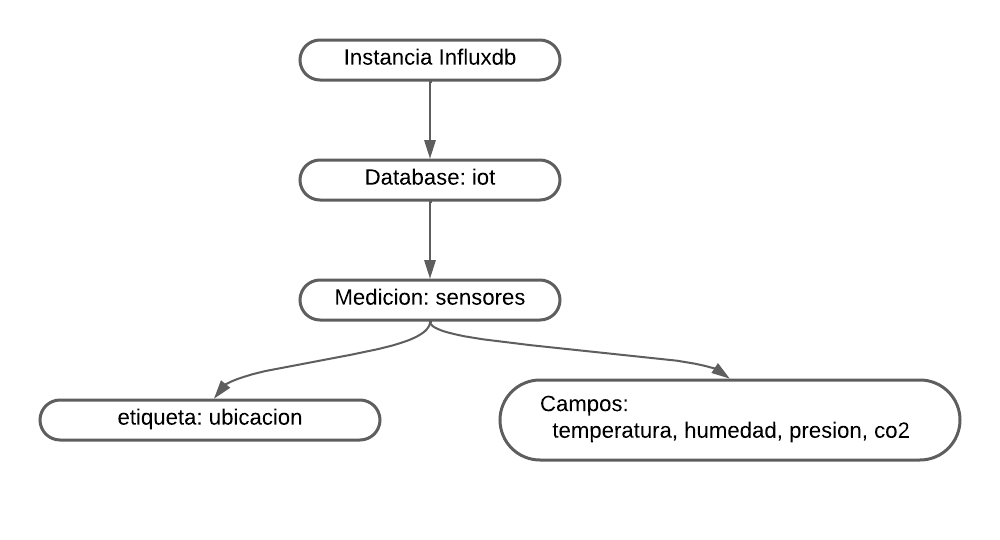

### Estructura de la base de datos

Diagrama de la base de datos:  



Se incluye los datos exportados desde una instancia de la base de datos:  
Comando:  
```
influx -database iot -execute "select * from sensores" -format csv > datos.lp
```
output:  
```datos.lp``` > Archivo que contiene los contenidos de la base de datos  

Para importar en otra instancia de la base de datos, al implementarse en otro ordenador:
```
curl -i -XPOST "http://192.168.1.100:8086/write?db=sensores" --data-binary @datos.lp
```
